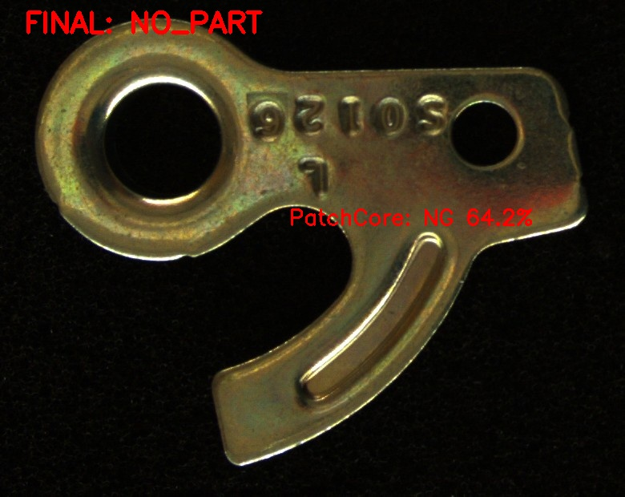
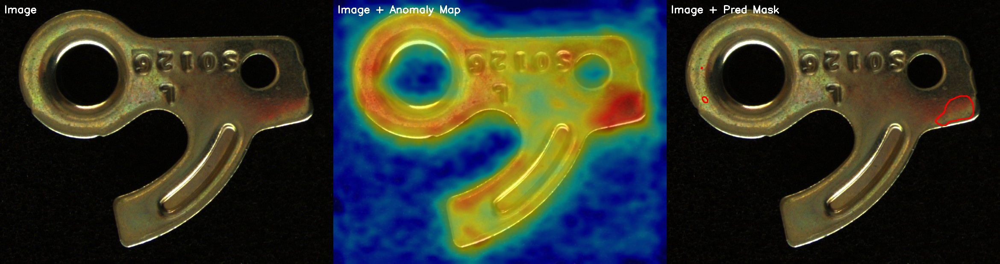
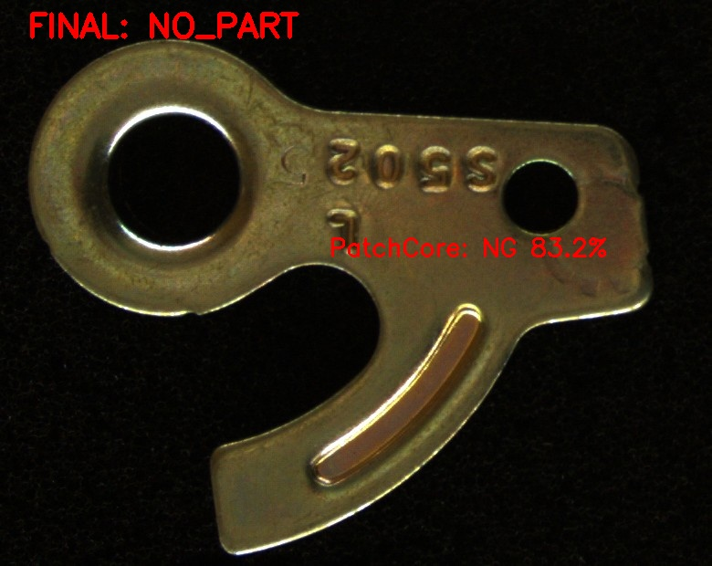
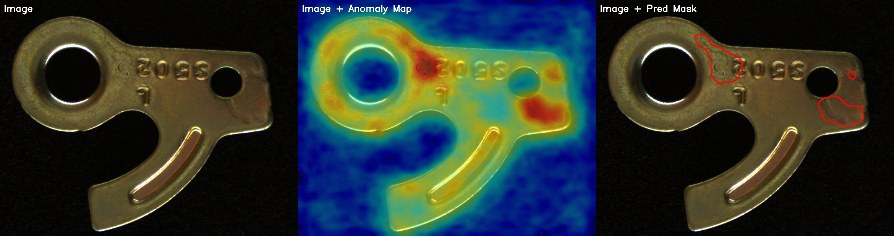
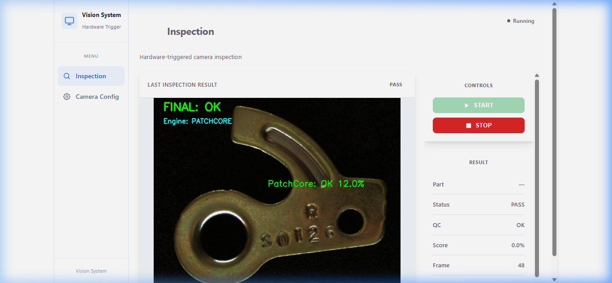
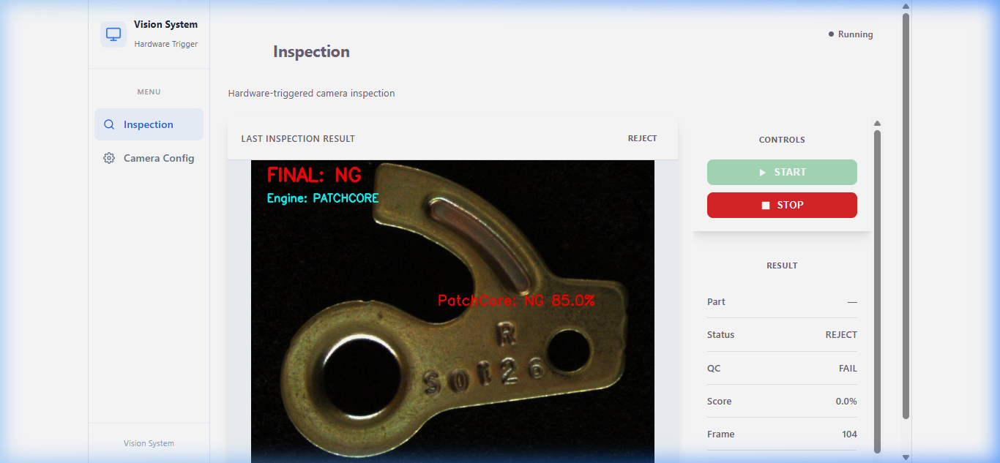
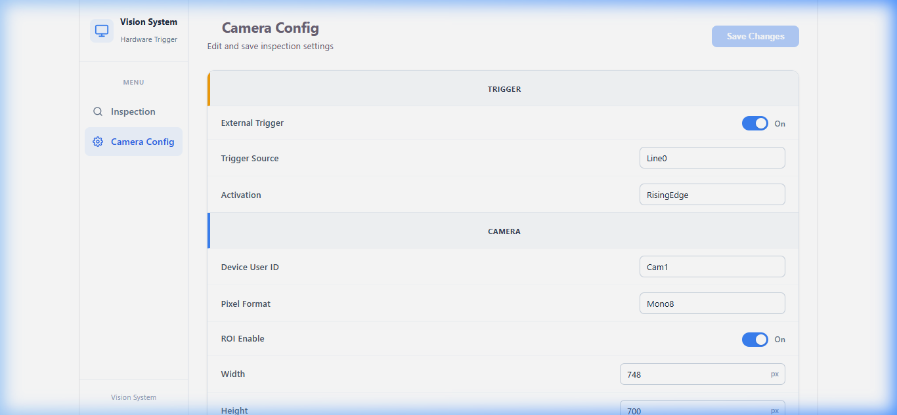

# Industrial Machine Vision Inspection System

A professional machine vision application designed for real-time quality control (QC) and defect detection on industrial manufacturing lines. This system integrates low-level industrial cameras, traditional computer vision, and deep learning anomaly detection to inspect parts under hardware-triggered conditions.

## Key Features
* **Hikrobot MVS SDK Integration:** Dynamic camera connection, static IP negotiation, and manual/auto exposure, gain, and white balance settings.
* **PLC Hardware Triggering:** Low-latency image acquisition synchronized via optocoupled digital input lines (`Line0 / RisingEdge`) connected to PLC output (e.g., sensor-actuated inspection signals).
* **Dual QC Processing Engines:**
  * **Template Matching Engine:** Pose alignment and part orientation/classification using Normalized Cross-Correlation (NCC).
  * **PatchCore Defect Engine:** PyTorch-accelerated deep learning anomaly segmentation (via `anomalib`) to detect scratches, dents, and surface irregularities with pixel-level heatmap overlays.
* **Decoupled Architecture:** High-speed grab thread feeding a thread-safe frame queue with parallel worker thread execution to ensure zero dropped frames.
* **REST API & MJPEG Stream:** FastAPI backend providing a multipart live-stream feed and system telemetry.
* **Modern Dashboard:** React (Vite) interface displaying real-time inspection diagnostics and configuration controls.

---

## Directory Structure

```text
├── backend/                  # Python API & core orchestration service
│   ├── camera/               # Industrial camera drivers and integrations
│   │   ├── get_image.py      # CameraController SDK wrapper (trigger, ROI, parameters)
│   │   └── mvs_sdk_path.py   # Centralized MVS SDK path utility
│   ├── engines/              # Image processing & ML inspection engines
│   │   ├── patchcore_engine.py # PyTorch PatchCore inference and heatmap visualizer
│   │   └── template_engine.py  # OpenCV template matching routine
│   ├── api.py                # FastAPI HTTP routes & MJPEG streaming generator
│   ├── inspection.py         # Main inspection system control & worker orchestration
│   └── requirements.txt      # Python dependencies list
├── frontend/                 # Vite + React user interface dashboard
│   ├── public/               # Static assets & icons
│   └── src/                  # React components, pages, hooks, and API client
├── models/                   # Neural network weights and pose templates
│   ├── templates/            # Expected template images for pose alignment (1.jpg to 8.jpg)
│   └── model.ckpt            # [Excluded] PatchCore model checkpoint file
├── tools/                    # Standalone utility scripts for dataset preparation
│   ├── capture_dataset.py    # Hardware/timer-triggered camera dataset capture script
│   └── convert_bayer_to_mono.py # Raw Bayer to Grayscale image converter
├── data/                     # Local data folders (ignored by Git)
├── docs/                     # Documentation & reports
│   ├── sample_images/        # Sample OK/NG part crop and anomaly visualizations
│   └── software_screenshots/ # Screenshots of the Vision System software (OK, NG, Camera Config)
├── config.json               # System runtime configuration file (ignored by Git)
├── config.json.example       # Redacted template configuration file
└── .gitignore                # Git ignore rules
```

---

## Installation & Setup

### 1. Prerequisites
* **Hikrobot MVS Software:** Ensure that the official Hikrobot MVS software and driver are installed on your host system.
* **Python 3.8+:** A Python environment (PyTorch and CUDA support recommended).
* **Node.js & npm:** For compiling and running the React dashboard.

### 2. Backend Setup
1. Clone the repository and navigate to the project root.
2. Setup a virtual environment:
   ```bash
   python -m venv venv
   source venv/bin/activate  # On Windows: .\venv\Scripts\activate
   ```
3. Install dependencies:
   ```bash
   pip install -r backend/requirements.txt
   ```
4. Copy the config template and customize your parameters (e.g., target camera ID, IP settings, trigger modes):
   ```bash
   copy config.json.example config.json
   ```

### 3. Fetching Model Checkpoint
> [!IMPORTANT]
> The PatchCore model weights checkpoint (`model.ckpt`) is excluded from Git to keep the repository lightweight. You should download the model weights (e.g., from your release assets or Git LFS) and save it directly in the `models/` directory:
> ```text
> models/model.ckpt
> ```

### 4. Frontend Setup
1. Navigate to the frontend directory:
   ```bash
   cd frontend
   ```
2. Install Node packages:
   ```bash
   npm install
   ```

---

## Running the Application

### 1. Start the Backend API
Run the FastAPI application from the project root directory:
```bash
python -m backend.api
```
The API server will launch at `http://localhost:8000`.

### 2. Start the Frontend Dashboard
Run the Vite development server:
```bash
cd frontend
npm run dev
```
Open `http://localhost:5173` in your browser to access the control panel.

---

## PLC Triggering & Hardware Wiring

In a production line, the system is designed to sync with a **PLC (Programmable Logic Controller)** (e.g., Siemens, Allen-Bradley, or Mitsubishi) for triggered image acquisition when parts pass the inspection station.

### 1. Electrical Wiring (Hikrobot 6-pin Hirose I/O Connector)
To trigger the camera via a 24V PLC digital output:
* **Line0 Input (Pin 2, Green/White):** Connect to the PLC digital output trigger terminal (delivers the 24V trigger pulse).
* **LineGnd (Pin 5, Blue):** Connect to the PLC reference ground (0V) to complete the optocoupled circuit.
* **Optocoupler Isolation:** The camera's digital input line is optocoupled. If utilizing a non-standard sensor or PLC logic level (e.g., 5V TTL), reference the Hikrobot manual for current-limiting resistor requirements.

### 2. Configuration Parameters
In `config.json`, configure the trigger source to listen to the physical I/O line:
* `"use_external_trigger"`: Set to `true` to disable continuous free-run acquisition and wait for physical PLC signals.
* `"trigger_source"`: Set to `"Line0"` (specifies the physical optocoupled input line).
* `"trigger_activation"`: Set to `"RisingEdge"` to capture the frame immediately when the PLC output transitions from Low (0V) to High (24V).

---

## Processed Inspection Sample Images

Below are samples of the raw part crops and the corresponding PatchCore anomaly segmentation heatmaps/prediction masks generated by the inspect engine:

### 1. Conforming Parts (OK)
Parts with no surface irregularities. The PatchCore engine assigns low anomaly scores and reports a PASS:

| Raw Inspection Crop | PatchCore 3-Panel Visualization (Normal) |
|:---:|:---:|
|  |  |

### 2. Defective Parts (NG)
Parts containing scratches, dents, or tooling anomalies. The PatchCore engine successfully isolates the defects, overlaying a high-intensity red heat map region and surrounding the anomalies with outline contours:

| Raw Inspection Crop | PatchCore 3-Panel Visualization (Defective) |
|:---:|:---:|
|  |  |

---

## Software Screenshots

Here is a preview of the application interface under different inspection states and configuration views:

### 1. Inspection Dashboard (OK / Passing Part)
Shows a green indicator overlay with template match coordinates and PatchCore anomalies (none detected) when the part conforms to specifications.


### 2. Inspection Dashboard (NG / Defective Part)
Shows a red indicator overlay indicating structural or surface anomalies, with a pixel-level anomaly heatmap and prediction mask highlighting defects.


### 3. Camera Settings Page
Provides live parameter adjustments including manual/auto exposure times, gain values, subnet configuration, and ForceIP commands for low-level industrial hardware.


